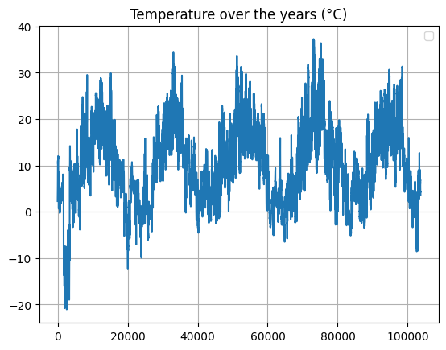

# Weather Time Series Analysis using Statistical Methods and Deep Learning Models

## Project Overview
This project conducts a thorough analysis of weather time series data using diverse statistical and deep learning models. Each model was rigorously applied to the same weather time series data to assess and compare their forecasting accuracy. Detailed results and analyses are provided to delineate the strengths and weaknesses of each approach.

##  Statistical Analysis of Variables

### Univariate Analysis
In this phase, individual variables are analyzed to understand their distribution and normality. Utilizing histograms and quantile-quantile (qq) plots, we gain insights into their characteristics.

<table>
  <tr>
    <td style="text-align: center;">
      
Histograms

      
    </td>
    <td style="text-align: center;">
      
Quantile-Quantile Plots

      
    </td>
  </tr>
</table>

### Correlation Analysis
Exploring relationships between variables, correlation analysis employs Pearson correlation coefficients. A correlation matrix visualized through a heatmap highlights the strengths of correlations with 'T (degC)', offering valuable insights into inter-variable relationships and dependencies.

<table>
  <tr>
    <td style="text-align: center;">
      
Heatmap of Correlation Coefficients

      
    </td>
  </tr>
</table>
      
## Data Visualization
Time series plots depict temperature variations over time, revealing both long-term trends and short-term fluctuations within seasonal cycles. Annual temperature trend analysis showcases maximum, average, and minimum temperatures annually, aiding in the interpretation of climate data and identification of seasonal patterns.

<table>
  <tr>
    <td style="text-align: center;">
      
Seasonality

      
    </td>
    <td style="text-align: center;">
      
Seasonality without Noise

      
    </td>
     <td style="text-align: center;">
      
Seasonality (First Season Cycle)

      
    </td>
     <td style="text-align: center;">
      
Temperature over the Years

      
    </td>
  </tr>
</table>

## Statistical Forecast Methods

### Fixed Partitioning for Statistical Methods based Forecasting
A systematic partitioning approach divides temperature data into training and testing sets. Data from 2012 to 2014 are allocated for training to enable model learning from historical data, while data from subsequent years are reserved for validation and testing, ensuring accurate predictions of future temperatures.

### Naive Forecast
Predictions are based solely on the last observed temperature, serving as a baseline for accuracy assessment.

### Moving Average Forecasting
Average temperatures over defined window sizes are computed to smooth short-term fluctuations and highlight long-term trends.

### Differenced Moving Average Forecast
By differencing to remove trends and seasonality before applying a moving average, this method refines predictions and improves accuracy.

## Deep Learning Models
Various deep learning models, including Basic Neural Network, Deep Neural Network, LSTM, Regularized LSTM, Bi-Directional LSTM, and Stacked GRUs, are explored for temperature forecasting, each tailored to leverage sequential data characteristics for enhanced prediction accuracy.

### Fixed Partitioning for Neural Network based Forecasting
Temperature data are split into training, validation, and testing sets ensuring chronological order and accounting for seasonality, essential for effective model training and evaluation.

### Data Preprocessing
Data normalization using MinMaxScaler ensures consistent scaling, particularly beneficial for non-normally distributed data and when training neural networks with features of different scales.

### Sequence Generation
Sequences are generated from input array data using TensorFlow's timeseries_dataset_from_array, facilitating training, validation, and testing of models with specified sequence lengths.

### Evaluation
Model performance is evaluated using Mean Absolute Error (MAE) metric on the test dataset, comparing predictions against actual values to quantify forecasting accuracy.

## Weather Forecast
Trained models are utilized to predict future temperature values, leveraging the learned patterns and dependencies in the data to provide accurate forecasts.

## Potential Improvements
- Adjust the number of units.
- Experiment with different learning rates and batch sizes.

## Data Sources:
- https://s3.amazonaws.com/keras-datasets/jena_climate_2009_2016.csv.zip

## License:
This project is licensed under the Raza Mehar License. See the LICENSE.md file for details.

## Contact:
For any questions or clarifications, please contact Raza Mehar at [raza.mehar@gmail.com].
